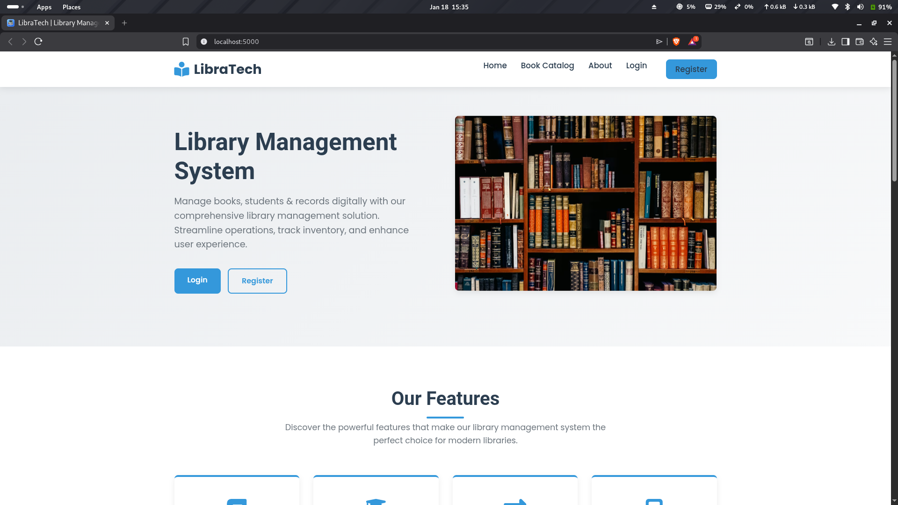
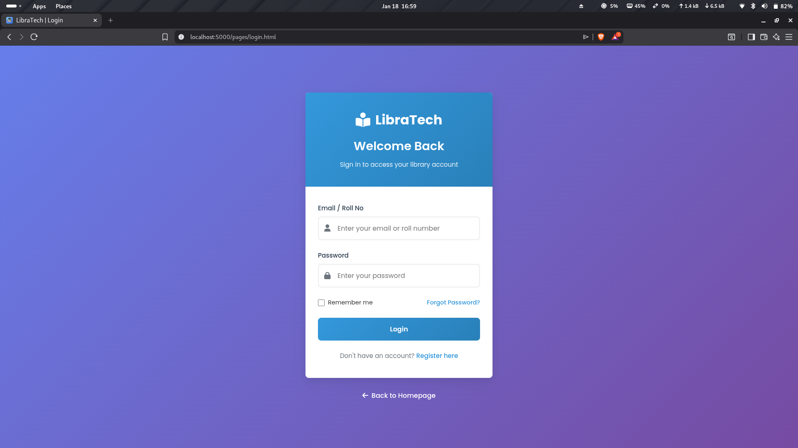
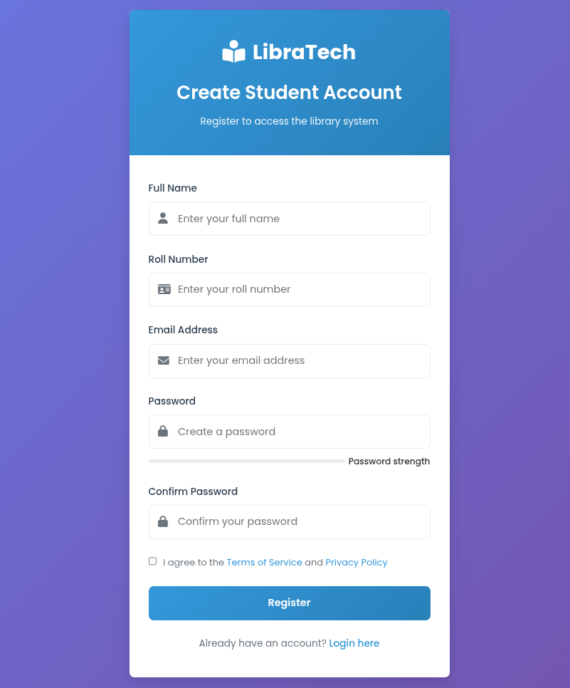
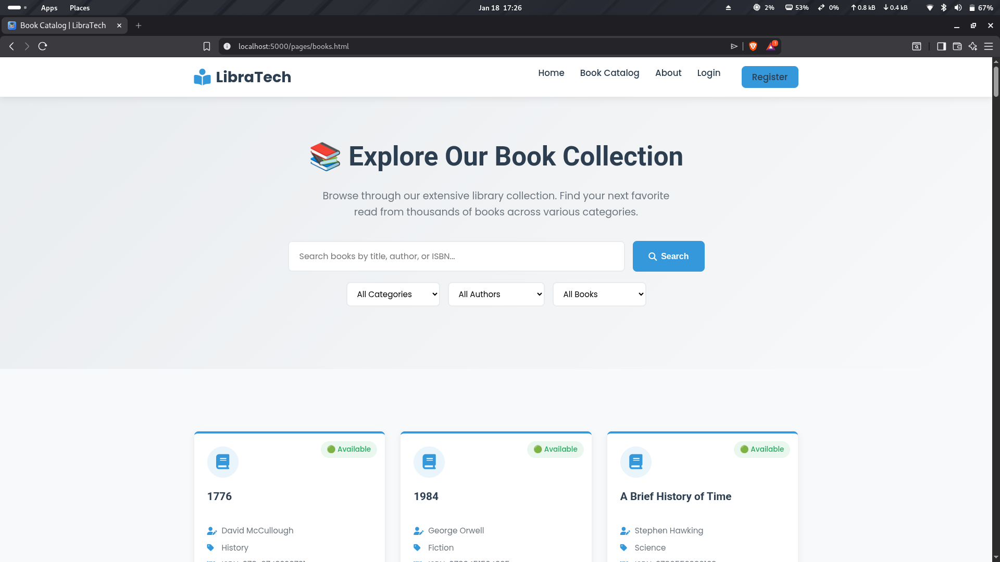
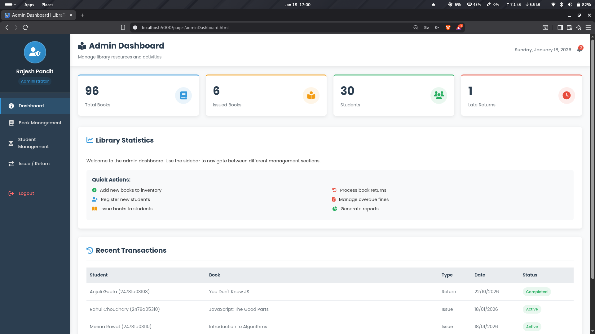
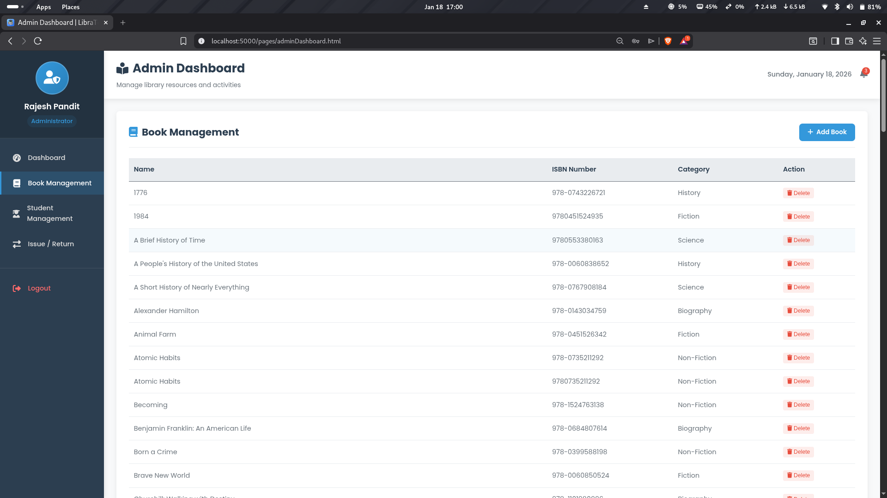
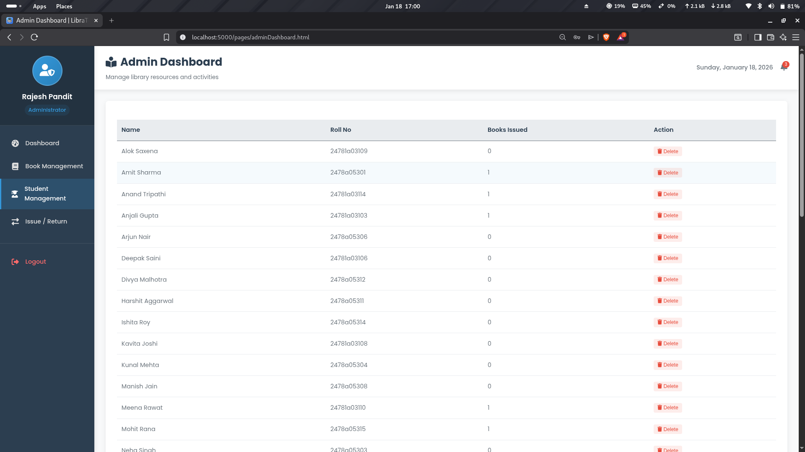
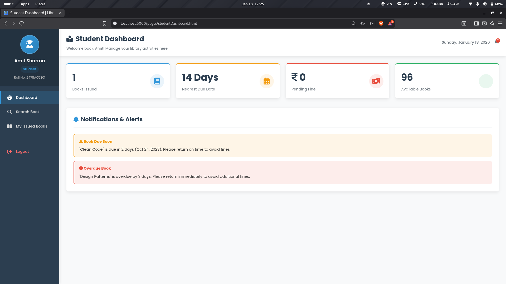

# 📚 Library Management System (Backend-Focused)

A **full-stack Library Management System** with a strong focus on **backend architecture and REST APIs**.  
This project is designed to demonstrate **real-world backend development**, API design, database modeling, and business logic handling using **Node.js, Express, and MongoDB**.

---

## 🧠 Project Overview

This system manages:
- Users (Admin & Students)
- Books (unique titles with multiple copies)
- Book issuing & returning
- Availability tracking in real time

The backend is built following **MVC architecture**, clean routing, and proper separation of concerns.

> ⚠️ Primary focus of this project is **Backend & APIs**, not UI.

---

## ✨ Core Features

### 🔐 Authentication & Authorization
- User Registration
- User Login
- JWT-based authentication
- Role-based access control (Admin / User)

### 📘 Book Management (Admin Only)
- Add books with multiple copies
- Update book details
- Delete books
- Track:
  - Total copies
  - Available copies
  - Issued copies

### 📖 Issue & Return System
- Issue books using **Roll Number**
- Prevent issuing when no copies are available
- Track issued books per user
- Return books and update availability automatically

### 📚 Availability Logic
- Shows **only unique books**
- Displays books only if `availableCopies > 0`
- Prevents duplicate listing of same book

---

## 🛠️ Tech Stack (Complete)

### 🧩 Backend (Primary Focus)
- **Node.js** – Runtime environment
- **Express.js** – Web framework
- **MongoDB** – NoSQL database
- **Mongoose** – ODM for MongoDB
- **JWT (JSON Web Token)** – Authentication
- **bcrypt** – Password hashing
- **dotenv** – Environment variables
- **cors** – Cross-origin requests
- **nodemon** – Development server

### 🎨 Frontend (Basic)
- HTML
- CSS
- JavaScript

### 🧪 Tools & Utilities
- npm
- Git & GitHub
- Postman (API testing)

---

## 🧱 Backend Architecture

The backend follows **MVC architecture**:

    Client
       ↓
    Routes (Express)
       ↓
    Controllers (Business Logic)
       ↓
    Models (MongoDB Schemas)
       ↓
    Database (MongoDB)

---

## 📂 Project Structure

Library-Management-System/ 
│ 
├── client/ # Frontend 
│ 
├── server/ # Backend 
│ ├── models/ # MongoDB schemas 
│ ├── routes/ # API routes 
│ ├── controllers/ # Business logic 
│ ├── middleware/ # Auth & error middleware 
│ ├── config/ # DB configuration 
│ └── server.js # Server entry point 
│ 
├── screenshots/ 
├── package.json 
├── .env 
└── README.md 

---

## 🖼️ Screenshots

> Below are screenshots showcasing the complete flow of **LibraTech – Library Management System**, including Admin, Student, and Public views.

---

### 🏠 Home Page
_Landing page for LibraTech with overview and entry points for login & registration._

---

### 🔐 Login Page
_User authentication page for Admins and Students._

---

### 📝 Register Page
_Student registration form with validation and password confirmation._

---

### 📚 Book Catalog (Public View)
_Searchable and filterable book catalog showing available books._

---

## 👨‍💼 Admin Panel

---

### 📊 Admin Dashboard
_Overview of library statistics including total books, issued books, students, and late returns._

---

### 📘 Book Management (Admin)
_Admin interface to add, view, and delete books with ISBN and category tracking._

---

### 🔄 Issue / Return Management
_Admin panel to issue books, return books, calculate fines, and view recent transactions._

---

### 🧑‍🎓 Student Management (Admin)
_View registered students, roll numbers, issued book count, and manage student records._

---

## 🎓 Student Panel

---

### 📊 Student Dashboard
_Student dashboard displaying issued books, due dates, pending fines, and notifications._

## 🚀 Installation & Setup Guide

Follow these steps to run the project locally.

---

### 1️⃣ Clone the Repository
git clone https://github.com/rashq-01/Library-Management-System.git
cd Library-Management-System

### 2️⃣ Install Backend Dependencies
npm install

### 3️⃣ Setup Environment Variables
PORT=5000 
MONGO_URI=your_mongodb_connection_string 
JWT_SECRET=your_secret_key 
 
Example :  
           PORT=5000 
           MONGO_URI=mongodb://127.0.0.1:27017/libraryDB 
           JWT_SECRET=library_secret 

### 4️⃣ Start the Backend Server
  npm install 
  npm start 
  Backend will run at: http://localhost:5000 
